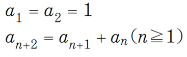

# Elixirについて

## Elixirとは

[Wikipediaによると]、以下の通りです。

Elixir (エリクサー) は並行処理の機能や関数型といった特徴を持つ、Erlangの仮想マシン (BEAM) 上で動作するコンピュータプログラミング言語である。

ElixirはErlangで実装されているため、分散システム、耐障害性、ソフトリアルタイムシステム等の機能を使用することができるが、拡張機能として、マクロを使ったメタプログラミング、そしてポリモーフィズムなどのプログラミング・パラダイムもプロトコルを介して実装されている。

Ruby on RailsのコアメンバーであるJosé Valimにより、2012年にリリースされた。
Rubyの構文や思想に影響を受けて作成されている。

## Elixirのメリット

- WebSocketが標準的なフレームワーク([Phoenix])で対応している。
- 動的型付け言語なので、構文が冗長にならずシンプルに書ける
- 関数型言語なので、オブジェクトの状態について意識しなくてよい。
  - デバッグ、プログラムを追いかけるのが容易になる。
  - 関数型言語のため、並列処理に強い。
  - サーバーのスペックがそのままパフォーマンスに反映される
- 関数型言語の割に学習コストが低いと言われている。
  - 簡潔に構文を書くことが出来る。
    - パターンマッチングやガード節といった強力な構文がある。
    - 特にメソッドチェーンが気持ちいい。以下はペイロードからSignatureを取得する例

``` elixir
signature =
  payload
  |> :public_key.sign(:sha, private_key)
  |> Base.encode64()
  |> String.to_charlist()
  |> Enum.map(&replace/1)
  |> to_string()
```

``` Java
String signature = replaceSpecialCharacter(Base.encode64(sign(payload, SHA, privateKey)).toCharArray()).toString()
```

Javaで1行で書こうとした際と比べると、関数の実行順序が分かりやすく、可読性が高い。
Javaの場合、まずどのメソッドが実行されるのかが分かりづらい。

## Elixirのデメリット

- 動的型付け言語のため、複数人の開発で使いづらいところはある
  - 特にメソッドの引数を[Map]型にすることが多く、引数に求められている値をメソッドの中身を確認して知ることが多い。
    - 業務上ではパブリックな関数の引数や戻り値の型は基本的に書くようにしていた。
- 黒魔術的な難しい構文(マクロ)がある
  - 自分でマクロを書いたことは殆どないですが、ライブラリーのソースなどで使用していることがあるので、多少は読み方を把握しておく必要があります。
- Elixirのマニュアルだけではなく、ErlangのAPIマニュアルの確認や、Erlangの仕様についても調査が必要となることがある。

## Elixirのハンズオン

## インストール方法

[Elixirのインストール]について記載します。

### [macOSの場合](https://elixir-lang.org/install.html#macos)

macの場合、以下の二通りの方法でインストールできます。

各ソフトウェアのバージョン管理などをかっちりとやりたいなら[asdf]がおすすめ。

とりあえずさくっと[Elixir]をインストールする場合、Homebrewでいいかなと思います。

- Homebrewを使ってインストールする
  - Homebrewをアップデートしてインストールする

``` shell
$ brew update
$ brew install elixir
```

- [asdf]を使ってインストールする
  - 事前にasdfをインストールする
  - Elixirとerlangのプラグインを追加する

``` shell
asdf plugin-add elixir \
    ; asdf plugin-add erlang \
```

  - asdfで使用できるバージョンを調べる
    - `asdf list all elixir`
  - asdfでelixirとerlangをインストールする
  
``` shell
asdf install erlang 23.1.1
asdf install elixir 1.11.1
```

### [Windowsの場合]

Windowsでのインストールは試していないのですが、 公式サイトによると、[インストーラーをダウンロード]して、
`Click next, next, …, finish`でインストールできます。


## Elixirの起動

ターミナルから`iex`コマンドで対話型のシェルとして起動できます。

``` elixir
$ iex
Erlang/OTP 22 [erts-10.6] [source] [64-bit] [smp:8:8] [ds:8:8:10] [async-threads:1] [hipe]

Interactive Elixir (1.10.3) - press Ctrl+C to exit (type h() ENTER for help)
```

### Hello world

コンソールに`Hello world`を出力してみましょう。

``` elixir
iex(1)> IO.puts("Hello world")
Hello world
:ok
```

ここで、`:ok`というのは,IO.putsのレスポンスになります。

なので、変数にレスポンスを格納することが出来ます。

``` elixir
iex(2)> result = IO.puts("Hello world")
Hello world
:ok

iex(3)> result
:ok

iex(4)> result == :ok
true

iex(5)> result == :no
false
```

上では、`result`にIO.putsの結果(`:ok`)を格納して、
そのまま出力、`:ok`,`:no`との比較を行いました。

`result`に`:ok`という値が格納されていることが確認できました。

ちなみに`:`で始まる文字列は[atom]という定数です。

atomは、Erlangのビルトインのものも含めたライブラリのモジュールを参照するのにも使われます。

次はコンソールに足し算の結果を出力してみます。

``` elixir
iex(6)> IO.puts(1 + 2)
3
:ok
```

次はモジュールを作成して、Elixirをファイルから実行する方法について解説します。

## モジュールファイルの作成

_Hello.ex_ というファイル名で以下のファイルを作成します。

``` elixir
defmodule Hello do
  def hello(name \\ "") do
    IO.puts("Hello world #{name}")
  end
end
```

``` shell
iex(1)> c("Hello.ex")
[Hello]
iex(2)> Hello.hello("hoge")
Hello world hoge
:ok
```

iexから`c("<ファイル名>")`で対象のファイルをコンパイルしてVMに展開します。

_モジュール名.関数名_ でモジュールに定義されている関数を呼び出すことが出来ます。

次はプロジェクトの作成に取り掛かりたいと思います。

## mixの使用

```
$ mix new example
```

上記のコマンドでプロジェクトのフォルダ構成と必要なボイラープレートが生成されます。

``` shell
$ cd example
$ iex -S mix
iex(1)> Example.hello()
:world
```

exmpleディレクトリーに移動して、iex -S mixでmixプロジェクトを対話型シェルで立ち上げます。

_Example.ex_ に定義してあるhello関数を呼び出します。

## 関数の定義

モジュールの中で関数を定義する事ができます。

関数は`def`、または`defp`で宣言します。

`def`の場合は _public_ な関数として、外部のモジュールから呼び出すことが出来ます。

`defp`の場合、 _private_ な関数として、定義されているモジュールの中からのみ呼び出せます。


``` elixir
  def hello() do
    IO.puts("Hello world. please tell me your name.")
  end

  def hello(name) do
    IO.puts("Hello world #{name}")
    name
  end

  def hello(name, age) do
    IO.puts("Hello world #{name} : #{age}")
    {name, age}
  end
```

上記は、`hello`関数を3つ定義しています。

Elixirは動的型付け言語なので、関数の引数に型の指定がありません。

また、関数の戻り値の型の指定もありません。

関数の戻り値は関数内で一番最後に呼ばれる関数の戻り値、または変数です。

そのため、上記の3つの関数ではそれぞれ戻り値が異なります。

hello/0の戻り値は:okです。

  これは、IO.puts関数の戻り値が:okだからです。

hello/1の戻り値は引数をそのまま返却します。

hello/2の戻り値は引数をタプルにして返却します。

※タプルは固定長の配列の様なイメージです。

また、ElixirではJavaなどの言語にある`return`はありません。

ガード節(早期`return`)は、以下の２つの方法で実現できます。

- `when`キーワードを利用する
- `パターンマッチング`を利用する。

`when`キーワードを利用する場合

``` elixir
def hello(name, age) when age < 20 do
  IO.puts("Hello world #{name} : #{age}")
  IO.puts("you are under twenty")
end

def hello(name, age) do
  IO.puts("Hello world #{name} : #{age}")
  IO.puts("you are over nineteen")
end
```

`when`キーワードを用いることで、関数の引数の条件を指定することが出来ます。

同一のシグネチャー(関数名と引数の数(_arity_))の関数が複数定義されている場合、

宣言された順番にwhenの条件に合致しているかの判断を行います。

なので、以下の様に、10歳未満の判定関数を20歳未満の次に宣言すると、

10歳未満の関数が呼ばれることはありません。

``` elixir
def hello(name, age) when age < 20 do
  IO.puts("Hello world #{name} : #{age}")
  IO.puts("you are under twenty")
end

def hello(name, age) when age < 10 do
  IO.puts("Hello world #{name} : #{age}")
  IO.puts("you are under ten")
end

def hello(name, age) do
  IO.puts("Hello world #{name} : #{age}")
  IO.puts("you are over nineteen")
end
```

`パターンマッチング`を利用する場合

``` elixir
def match(name, age) do
  pattern_match(name, is_under_twenty(age))
end
defp pattern_match(name, :ok) do
  IO.puts("Hello #{name}")
  IO.puts("you are under twenty")
end
defp pattern_match(name, :error) do
  IO.puts("Hello #{name}")
  IO.puts("you are over nineteen")
end

defp is_under_twenty(age) do
  if age < 20 do
    :ok
  else
    :error
  end
end
```

引数が指定された条件にマッチしているかどうかを確認して、
マッチしている場合にその関数が実行されます。

`when`の際と同様に、宣言した順番に判定を行います。

## 基本構文

if

``` elixir
  def is_under_twenty(age) do
    if age < 20 do
      IO.puts("age is under twenty")
      :ok
    else
      IO.puts("age is not less than twenty")
      :error
    end
  end
```

unless

``` elixir
  def is_under_twenty(age) do
    unless age > 20 do
      IO.puts("age is under twenty")
      :ok
    end
  end
```

ただし、unlessの使用はあまり推奨されていません。

for

``` elixir
  def hello_loop(count) do
    for x <- 1..count do
      IO.puts("hello #{x}")
    end
  end
```

Elixirでfor文を書く機会はあまりないと思います。

私は`for`を使用した記憶はないです。

Listの要素をループ処理する場合、`Enum.each`を使用します。

他にも、`Enum.map`、`Enum.filter`,`Enum.reduce`当りを活用することで、forを使用しないで書けると思います。

``` elixir
  def enum_loop(count) do
    Enum.each(1..count, fn(x) ->
      IO.puts("hello #{x}")
    end)
  end
```

## データ型、構造

基本的なデータ型として、以下があります。

- 文字列
- atom
- 数値型
  - integer
  - float
- bolean

データ構造として、コレクションを紹介します。

- マップ
- リスト
- タブル
- キーワードリスト

``` elixir
  def collection(count) do
    # mapの宣言
    # キーにはatom、文字列の何れかが使えます。
    # atomをキーに使用する場合
    mike = %{name: "mike", age: 35}

    # 文字列をキーに使用する場合
    bob = %{"name" => "bob", "age" => 25}

    # mapの値を取得する。
    # キーワードがatomの場合、.<キー>, .<[atom]>の何れかの方法で値を取得できる。
    IO.puts(mike.name)
    IO.puts(mike[:name])
    # キーワードが文字列の場合、[文字列]で値を取得できる。
    IO.puts(mike["name"])

    # mapへの要素の追加
    mike_with_jobs = Map.put(mike, :job, "engineer")

    # mapの全要素を出力する。
    Enum.each(mike_with_jobs, fn(key, val) ->
      IO.puts("#{key} : #{val}")
    end)
    

    # listの宣言
    users_list = [mike, bob]

    # listの値の取得

    # タプルの宣言
    users_tuple = {mike, bob}

    # キーワードlistの宣言
    keyword_list = [first: mike, second: bob]

  end
```

## ハンズオン

## 問題1

時間計算をする。

関数の引数には秒が与えられるので、 何分かを出力する。

1分未満の秒数は切り捨てる。

`div`という割り算で切り捨てを行うビルトイン関数があります。

例1.
input: 100
output: 1

例2.
input: 3600
output: 60

## 問題2

Fizz Buzz問題を解く

1から30までの数字をループ処理する。

- 3の倍数の時に、Fizzを出力する。
- 5の倍数の時に、Buzzを出力する。
- 3と5の倍数のときに、FizzBuzzを出力する。
- 上記以外の場合は数字を出力する。
 
以下の様な感じになります。

``` shell
1
2
Fizz
4
Buzz
Fizz
7
```

## 問題3

Listに重複した数字が含まれている場合に、排除して返却する関数を記載する。

例.

``` text
['Mike', 'Bob', 'Jane', 'Mike']
⇒
['Mike', 'Bob', 'Jane']
```

[Enum#uniq]という関数があり、これで要素の重複を弾くことが出来ます。

## フィボナッチ数列を解く

[フィボナッチ数列]とは、「2つ前の項と1つ前の項を足し合わせていくことでできる数列」のことです。数列は「1,1」から始まり、

1, 1, 2, 3, 5, 8, 13, 21…

と続いていきます。



[100番目までのフィボナッチ数列]

`fibonacci.ex`に解き方を定義する。

## 他にも参考になること

- [Elixirのコーディング規約]
  - 私が参画していた案件で使用していた規約になります。
- [Elixirのパターンマッチを攻略しよう]
  - Qiitaの記事ですが分かりやすい内容でした。

[atom]: https://elixirschool.com/ja/lessons/basics/basics/#アトム
[asdf]: https://asdf-vm.com/#/
[Discordが500万のユーザーの同時接続]: https://blog.discord.com/scaling-elixir-f9b8e1e7c29b
[Enum#uniq]: https://hexdocs.pm/elixir/Enum.html#uniq/1
[Elixir]: https://elixir-lang.org/
[Elixirのインストール]: https://elixir-lang.org/install.html
[Elixirのコーディング規約]: https://github.com/rrrene/elixir-style-guide
[Elixirのパターンマッチを攻略しよう]: https://qiita.com/naoya@github/items/9da982febe89d83cb5b5
[ETS]: https://hexdocs.pm/ets/ETS.html
[ETSでテーブルを作成]: https://erlang.org/doc/man/ets.html#new-2
[FastGlobal]: https://github.com/discord/fastglobal
[Hex]: https://hex.pm/
[macOSの場合]: https://elixir-lang.org/install.html#macos
[Map]: https://hexdocs.pm/elixir/Map.html
[Phoenix]: https://www.phoenixframework.org/
[Phoenix Projectの作成]: https://hexdocs.pm/phoenix/up_and_running.html
[Phoenixのインストール]: https://hexdocs.pm/phoenix/installation.html
[Wikipediaによると]: https://ja.wikipedia.org/wiki/Elixir_(%E3%83%97%E3%83%AD%E3%82%B0%E3%83%A9%E3%83%9F%E3%83%B3%E3%82%B0%E8%A8%80%E8%AA%9E)
[Windowsの場合]: https://elixir-lang.org/install.html#windows
[100番目までのフィボナッチ数列]: http://www.suguru.jp/Fibonacci/Fib100.html
[インストーラーをダウンロード]: https://github.com/elixir-lang/elixir-windows-setup/releases/download/v2.1/elixir-websetup.exe
[フィボナッチ数列]: https://www.studyplus.jp/445
